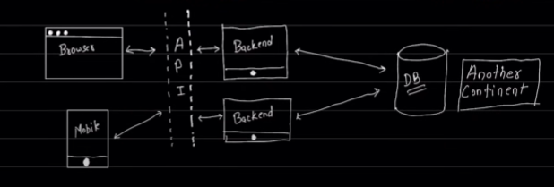

2 Major Component (server is just a software)

1. A Programming Language (Java , Js , Php , golang  , C++)

2. A DataBase(Mongo , MySql , Postgres , Sqlite) => (ORM ODM)

Databse is in another cotinent 

A java Script Based Backend 

Data File Third Party(API)

A JS Runtime : Node.js / Deno / Bun 

Package.json .env (Readme , git ,lint , prettier etc)

src -> Index(DB Conects) APP(Config , Cookie , urlencode) Constants(enums , DB-name)
<!-- ----------- -->
DB --> Actuall code that connects database 
Models --> Data Model 
Controllers --> Methods and functionality  
Routers --> /signup / home
MiddleWares --> 
Utils --> utility (mail karna hai , File Upload  , )
More(depends)
<!-- ---------------- -->

